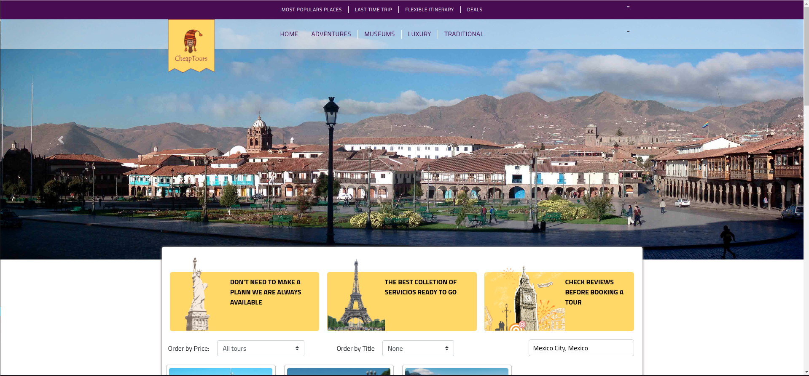
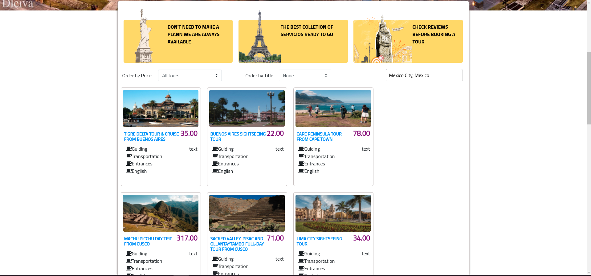

<p align="center">
    
</p>

<p align="center">
    <h1 align="center"> Catalogue of Dog Clothes   </h1>    
</p>

<p align="center">
    <h2 align="center"> Web application desktop version to list tours and check details</h2>    
</p>


<p align="center">
    <a href="https://img.shields.io/badge/Microverse-blueviolet" alt="Contributors">
        </a>
    <a href="https://www.w3schools.com/js/js_es6.asp" alt="JavaScript">
        </a>
    <a href="https://webpack.js.org/" alt="Webpack">
        </a>      
    <a href="https://getbootstrap.com/" alt="Bootstrap">
        </a>
    
</p>

  <p align="center">    
    <br />
    <a href="https://github.com/rubenpazch/catalogue-of-dog-clothes"><strong>Explore this project »</strong></a>
    <br />
    <br />&#10023;
    <a href="https://reverent-lamport-faa64f.netlify.app/tourdetail/8472">View Demo</a>   &#10023;  
    <a href="https://github.com/rubenpazch/catalogue-of-dog-clothes/issues">Report Bug</a>    &#10023;
    <a href="#Getting-Started">Getting Started</a> &#10023; <a href="#Install">Installing</a> &#10023;
    <a href="#Extra-Feature">Extra Feature</a> &#10023;
    <a href="#Screenshots-of-the-App">Screenshots of the App</a> &#10023;
    <a href="#Authors">Author</a> &#10023;
    
  </p>


<br/>


Catalog of Dog Clothes is a web application desktop version to receive a list of tours from an API, this information is dynamic, we are able to filter our list by price, title or also we can use the search option to find tours for a specific city (New York, Mexico Cito, Lima, Boston), check tours details by clicking each tour. This application was build using <b> React & Redux </b> you can find the full requirements   <a href="https://www.notion.so/Catalogue-of-Dog-Clothes-8bf1512b8ab34fa28848beb8ab698a32" alt="Requirements">here</a>. 


<br/>


<br/>

## Getting Started

This project was built using React and Redux version 17, it is a web application and for running on your local environment you should follow these guidelines.


### Prerequisites

- Ruby 17.0.0
- Redux 4.0.5
- Git
- React Testing Library
- CSS modules 
- React Hooks

### Setup

The project repository can be found in [GitHub link](https://github.com/rubenpazch/catalogue-of-dog-clothes) or just clone the project using this command. 


```
Using SSH 

# git clone  git@github.com:rubenpazch/catalogue-of-dog-clothes.git

Using HTTPS

# git clone  https://github.com/rubenpazch/catalogue-of-dog-clothes.git

```

+ Open terminal on your workspace with

```
cd /home/workspace/catalogue-of-dog-clothes
```


## Install


To get started with the app, clone the repo, and then install the needed packages using yarn or npm:

```
# npm install or yarn install
```

to start the local application run:

```
# npm start
```


### Usage

To watch the local version of this project check on your browser for the link 

```
Listening on tcp://127.0.0.1:3000
```

### Run tests

Run the test suite to verify that everything is working correctly:

```
# npm test
```

If the test suite passes, you'll be ready to run the app in a local server:


### Deployment

To deploy to netlify just push your changes and create a new project inside netlify, the link your account with github, remenber that you can use 

<b>npm run build or yarn build</b>


## Optional Features

+ For this project it was 
+ stylelint
+ Amadeus API
+ React Testing Library
+ CSS modules 
+ React Hooks

<br/>

## Watch the Live Version


click on the link to watch [live version](https://reverent-lamport-faa64f.netlify.app/)

<br/>


## Screenshots of the App


<br/>


<br/>


## Contributing

This project was created for educational purposes as part of the Microverse web development curriculum; contributing is not accepted.

Feel free to check the [issues page](https://github.com/rubenpazch/Group-our-transactions/issues).


## Authors

👤 **Ruben Paz Chuspe**

- Github: [@rubenpazch](https://github.com/rubenpazch)
- Linkedin: [rubenpch](https://www.linkedin.com/in/rubenpch/)
- Twitter: [@ChuspePaz](https://twitter.com/ChuspePaz)

### Show your support

Give a ⭐️ if you like this project!


## License

This project is licensed under the MIT License - see the [LICENSE.md](LICENSE.md) file for details

## Acknowledgments

* [Creative Commons ](https://creativecommons.org/licenses/by-nc/4.0/)

* [behance.net ](https://www.behance.net/gallery/24531031/Pimp-my-DOG-Online-store-E-commerse-project)

* [Amadeus](https://developers.amadeus.com/)